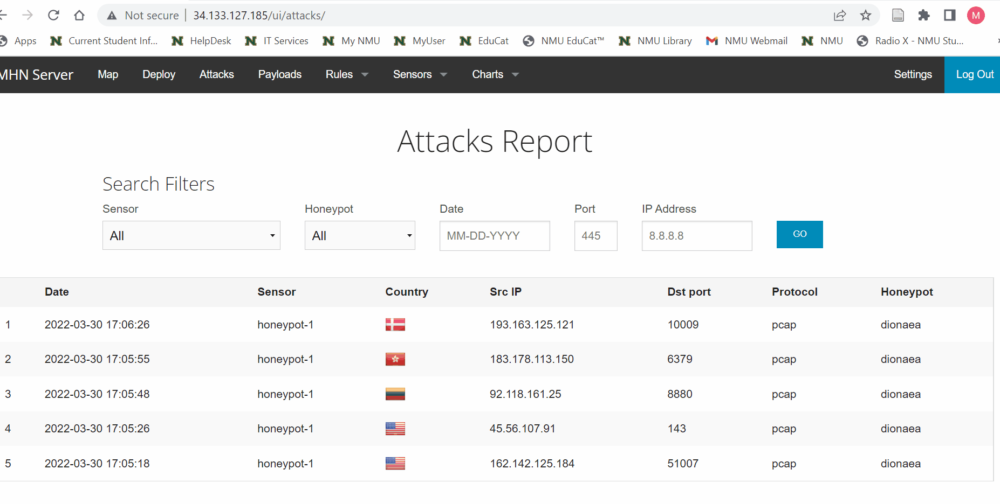

# Honeypot Assignment

**Time spent:** **X** hours spent in total
4 hrs

**Objective:** Create a honeynet using MHN-Admin. Present your findings as if you were requested to give a brief report of the current state of Internet security. Assume that your audience is a current employer who is questioning why the company should allocate anymore resources to the IT security team.

### MHN-Admin Deployment (Required)

**Summary:** How did you deploy it? Did you use GCP, AWS, Azure, Vagrant, VirtualBox, etc.?
I used GCP to deploy the honeypot. I copy and pasted instructions. 
Replacing backslashes with ^.
gcloud compute firewall-rules list

gcloud compute firewall-rules create http \
    --allow tcp:80 \
    --description="Allow HTTP from Anywhere" \
    --direction ingress \
    --target-tags="mhn-admin"

gcloud compute firewall-rules create honeymap \
    --allow tcp:3000 \
    --description="Allow HoneyMap Feature from Anywhere" \
    --direction ingress \
    --target-tags="mhn-admin"

gcloud compute firewall-rules create hpfeeds \
    --allow tcp:10000 \
    --description="Allow HPFeeds from Anywhere" \
    --direction ingress \
    --target-tags="mhn-admin"
    
    gcloud compute instances create "mhn-admin" \
    --machine-type "n1-standard-1" \
    --subnet "default" \
    --maintenance-policy "MIGRATE" \
    --tags "mhn-admin" \
    --image-family "ubuntu-minimal-1804-lts" \
    --image-project "ubuntu-os-cloud" \
    --boot-disk-size "10" \
    --boot-disk-type "pd-standard" \
    --boot-disk-device-name "mhn-admin"
    
    sudo apt update
sudo apt install git python-magic -y

cd /opt/
sudo git clone https://github.com/pwnlandia/mhn.git
cd mhn/

sudo sed -i 's/Flask-SQLAlchemy==2.3.2/Flask-SQLAlchemy==2.5.1/g' server/requirements.txt

sudo ./install.sh

### Dionaea Honeypot Deployment (Required)

**Summary:** Briefly in your own words, what does dionaea do?
Dionaea captures and attacks payloads and malware.

### Database Backup (Required) 

**Summary:** What is the RDBMS that MHN-Admin uses? What information does the exported JSON file record?
I wasnt able to gather info on RDBMS that mhn-admin uses. JSON files Log file of the captures. IP and locations are captured

*Be sure to upload session.json directly to this GitHub repo/branch in order to get full credit.*
{"sid":"5acf4122e8d14c75b1fd457cbc3a5dc5","init":true,"started":"2022-03-11T17:44:46.677Z","timestamp":"2022-03-11T17:45:05.202Z","status":"ok","errors":0,"did":"46cb46c6-ce80-5116-885d-2228b08b5e28","duration":18.524999856948853,"attrs":{"release":"Slack@4.24.0","environment":"production"}}

### Deploying Additional Honeypot(s) (Optional)

#### X Honeypot

**Summary:** What does this honeypot simulate and do for a security researcher? 

### Malware Capture and Identification (Optional)

#### X Malware

**Summary:** How did you find it? Which honeypot captured it? What does each malware do?

MD5 Hash: *Run `md5sum` on the file and record the hash here.*

SHA1 Hash: *Run `sha1sum` on the file and record the hash here.*

## Notes

Describe any challenges encountered while doing the assignment. Nothing works.....
