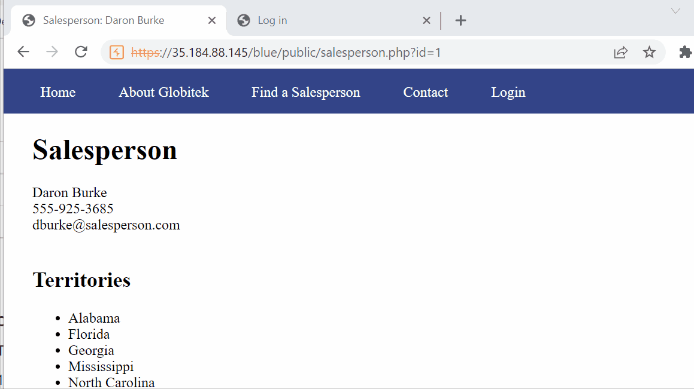
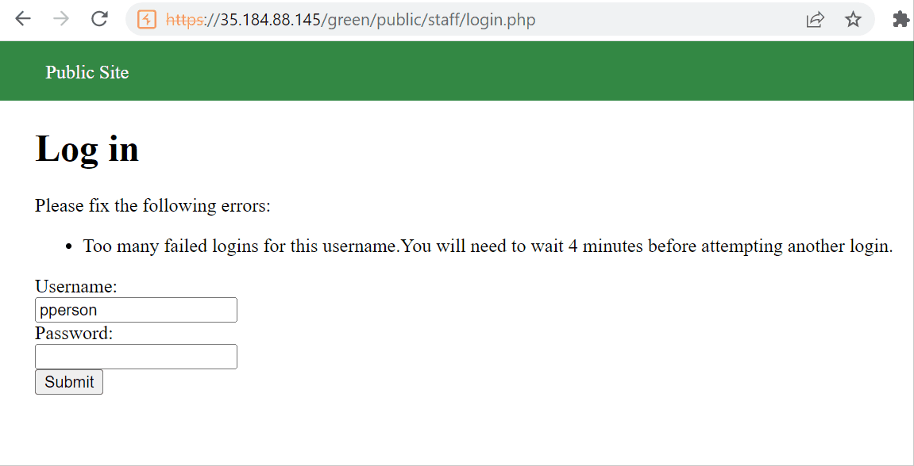
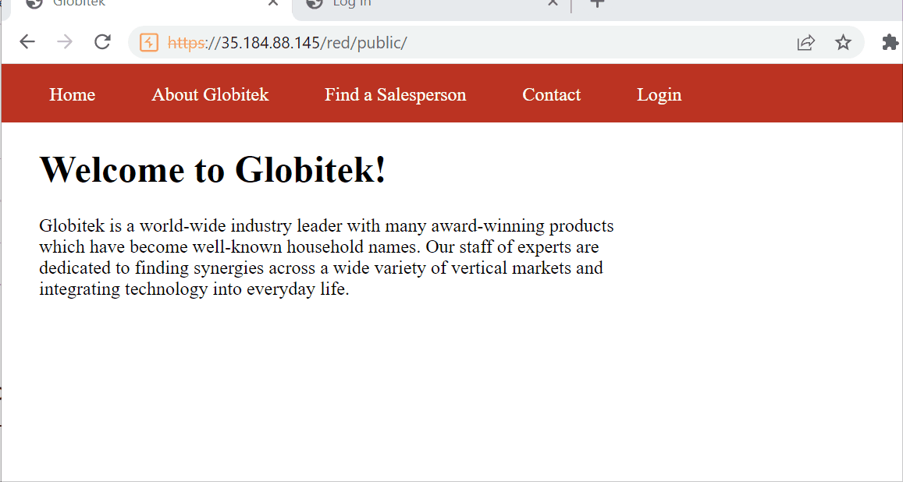

# codepath_hw
# Project 8 - Pentesting Live Targets

Time spent: **3** hours spent in total

> Objective: Identify vulnerabilities in three different versions of the Globitek website: blue, green, and red.

The six possible exploits are:

* Username Enumeration
* Insecure Direct Object Reference (IDOR)
* SQL Injection (SQLi)
* Cross-Site Scripting (XSS)
* Cross-Site Request Forgery (CSRF)
* Session Hijacking/Fixation

Each color is vulnerable to only 2 of the 6 possible exploits. First discover which color has the specific vulnerability, then write a short description of how to exploit it, and finally demonstrate it using screenshots compiled into a GIF.

## Blue

Vulnerability #1: Blind sql injection. I clicked on find a salesman, then clicked on Daron Burke. I then clicked on the url and added a single quote at the end of the URL, then enter. The response was Database query failed. 

## Green

Vulnerability #1: I go to green site, click on log in. Type pperson for username and the response in bold"Log in was successful" So it would bold it for valid users and it would be unbold for unvalid users.

## Red

Vulnerability #1: INSECURE DIRECT OBJECT REFERENCE Clicked on red, then clicked on salesperson, click on Daron Burke. Check the url. the end has a number that can be manipulated. Add a zero to end of url. It changes the number from 1 to 10. It then breaks, and opens into the salesperson Testy Mctesteron.

## Notes

Describe any challenges encountered while doing the work
Navigation of github. Endless issues.
